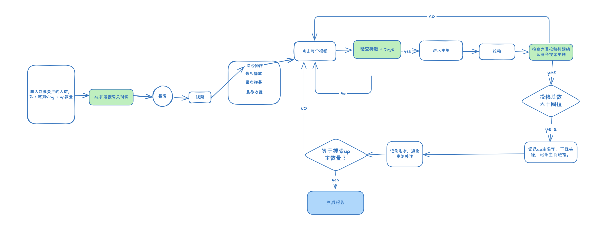

# Bili Up Finder

中文 | [English](README_en.md)

## 项目简介

Bili Up Finder 是一个基于LLM + Playwirght，旨在帮助用户根据关键词搜索 Bilibili Up主。它提供了关键词扩展、相关性判断以及使用 AI 助手生成报告等功能。


## 配置说明

1. 确保已安装 Python 3.12 或更高版本。
2. 安装[uv](https://docs.astral.sh/uv/getting-started/installation/).
3. 在环境变量/.env文件中配置 OpenAI/Deepseek（推荐DeepSeek） 的 API 密钥：
   ```bash
   export OPENAI_API_KEY="your_api_key_here"
   export DEEPSEEK_API_KEY="your_api_key_here"
   ```


## 使用示例

生成搜索查询的报告：
```bash
   uv run -m bili_up_finder -q "摄影" -n 10  
```
生成的报告会保存在reports目录下。

## 项目逻辑




## TO-DO
- [ ] 支持incremental search。
- [ ] 增加本地缓存功能。如搜索关键字相似且数量小于已缓存数量，则直接返回结果。
  

## 许可证

本项目使用 MIT 许可证授权。